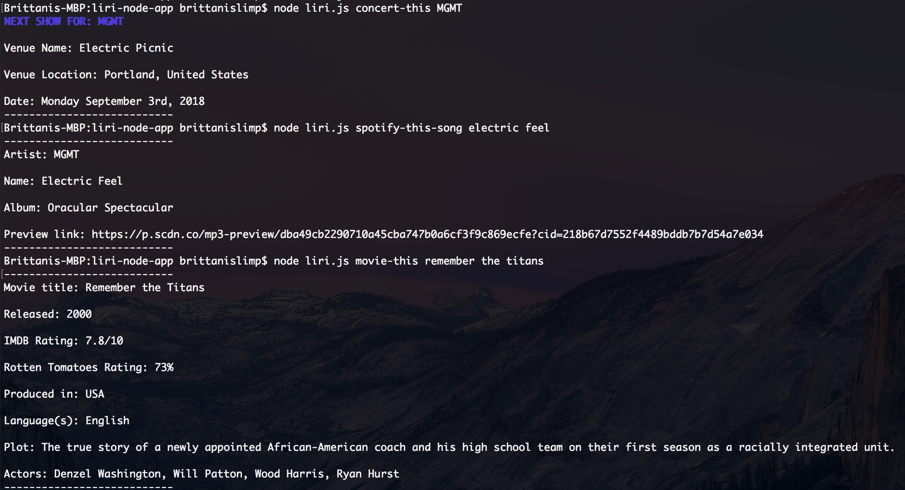

# LIRI Bot

## Project Overview

The LIRI (Language Interpretation and Recognition Interface) bot is a command line Node application that allows the user to search Spotify for songs, Bands in Town for concerts, and OMDB for movies. 

## Installation

Begin by cloning the repo in your terminal and cd into the liri-node-app
```
git clone https://github.com/brittani1128/liri-node-app.git
cd liri-node-app
```

Install necessary packages

```
npm install
```

Create your own .env file and add the following code:

```
# Spotify API keys

SPOTIFY_ID=your-spotify-id
SPOTIFY_SECRET=your-spotify-secret

# Bands In Town API key

BANDS_IN_TOWN_KEY=your-bandsintown-api-key

# OMDB API key

OMDB_KEY=your-omdb-api-key
```

## Usage

Begin each query with ```node liri.js``` followed by one of the available subcommands:

```movie-this <movie-name>``` searches the OMDB database for the specified movie name and returns information about ratings, release date, plot, etc. 

```concert-this <artist-name>``` searches BandsInTown for specified artist and provides upcoming concerts with venue and date 

```spotify-this-song <song>``` searches Spotify for specified song and returns information about song, artist, album, etc. 

```do-what-it-says``` executes commands found in random.txt file


<p align="center">
    
</p>